# iDeploy

* [1.简介](#desc)

* [2.项目技术栈](#tech)

* [3.快速启动](#quickstart)

* [4.部署第一个项目](#firstpro)

* [5.多语言支持](#morelang)

* [6.编写插件支持高级功能](#advanced)

## 简介

ideploy是为前端团队构建部署工程化而开发的一个持续交付平台.我们根据团队人员，项目增长而面临的越来越多在构建，交付等日常工作中的痛点，设计了很多特有而简单易用的功能，节省了团队很多构建部署的协调和copy体力工作，极大的提升了团队的开发效率。随着功能的完善，觉得这个系统可以帮助很多类似我们这样成长中的前端团队（当然系统其实也是支持java,php等项目的部署的，通过插件编写也可以支持go甚至更多语言的构建部署）实现快速构建，快速部署，放心上线。

## 技术栈

 1.  开发语言： [nodejs](http://nodejs.org/ "nodejs") 
 
 2. 数据库: [mysql](https://www.mysql.com/) 

 3. 后端框架： [thinkjs](https://thinkjs.org/) 

 4. 前端js框架  [react](https://github.com/facebook/react) 

 5. 前端ui框架  [ant.design](https://ant.design) 

## 快速启动(只支持linux)
1. git clone xxxxx.git 代码到本地
2. 安装nodejs 依赖:在根目录下运行npm install
3. 安装ansible （依赖ansible做部署前后的命令行执行）
4. 安装mysql 数据库，这里就不展开讲了，具体请参考:[mysql文档](https://dev.mysql.com/doc/refman/5.7/en/) 
5. 新建一个数据库（名字自己取一个就行，比如fe_build），并且开放足够的访问权限，具体可以参考[mysql文档](https://dev.mysql.com/doc/refman/5.7/en/database-use.html)
6. 配置数据库：
   

     
     打开src/common/config/db.js,分别填写数据库ip地址，数据库名称，用户名和密码,如下所示
    <pre><code>
    export default {
    type: 'mysql',
    log_sql: true,
    log_connect: true,
    adapter: {
        mysql: {
            host: '127.0.0.1',
            port: '',
            database: 'wdfe_publish',
            user: 'root',
            password: '',
            prefix: '',
            encoding: 'utf8'
        },
    }
	}
	</code></pre>
   

7. 代码，通知邮件等访问权限配置：
   

     由于构建部署系统需要从代码仓库（svn,git）拉取代码，所以需要首先配置svn仓库用户名和密码
     
     
     
     打开src/common/config/config.js，分别填写各项配置,具体如下：
         <pre><code>
export default {
    cvsUser: 'myuser',//svn用户名
    cvsPass: 'mypass',//svn密码
    emailHost: 'smtp.qq.com',//通知邮箱地址,这里用qq邮箱作为参考
    emailport: 465,//端口
    emailUser: '3333@qq.com',//邮箱账号
    emailPass: 'xxxxx',//邮箱授权码(具体可以登录mail.qq.com->设置->账户->POP3/IMAP/SMTP/Exchange/CardDAV/CalDAV服务->生成授权码获取)
    cvsDir: '/temp',//svn代码临时保存目录
    port: 80 //服务器端口，就是部署平台的web服务端口，
}
	</code></pre>
	

	
	如果是git项目请保证部署机器能直接有访问git的权限
   

   
8. 代码编译，启动
	
输入命令以下命令进行编译：

	 <pre><code>
	 npm run build 
	 </code></pre>
	
编译完成，运行以下名命令启动：

	 <pre><code>
	 npm run start
	 </code></pre>	 
	 
	
也可以用forever或者pm2来管理服务，以forever为例:
	 <pre><code>
	 npm install -g forever
	 </code></pre>	
	项目内置了forever的启动和停止脚本：
	<pre><code>
	 ./start.sh
	 ./stop.sh
	 </code></pre>	
	
 
	服务器起来以后，我们直接访问
	
	http://localhost
	
	页面自动跳到登录注册页面，说明启动成功：
	

9. 导入数据库脚本，生成数据库基础表结构
   这一步主要是为系统运行创建需要的数据库表，为了方便大家使用，项目提供了一个web程序来建立表结构，直接输入:
  
   http://localhost/install
   
会出现如下界面，点击‘确定导入数据库表’生成数据库。
   
   

   
   当然，也可以通过mysql 直接倒入数据库表结构文件，数据库表文件是db/db.sql
  
	
	

## 构建部署第一个项目

1. 注册系统用户
   第一次进入系统会直接跳到登录页，如果没有注册过则点击底部注册链接进行填写用户名密码进行注册，如果注册过则登录即可
   
2. 填写项目信息
   登录进入主界面，我们点击左边菜单的新建工程填写工程基本信息,如下所示：
   
    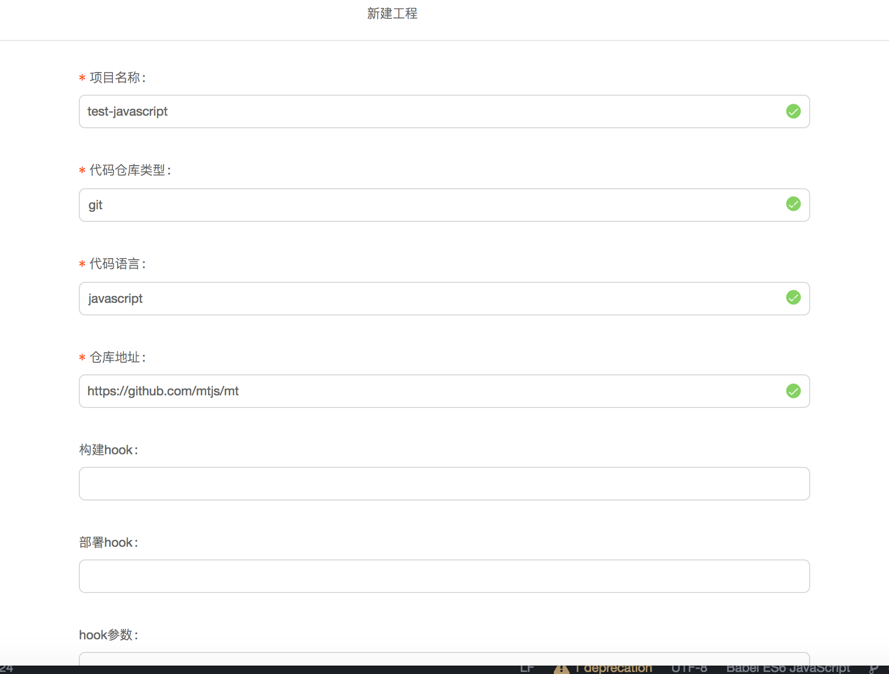
  
    
    分别填写项目名称，代码仓库类型，项目语言，代码仓库地址，后面的构建hook,部署hook,hook参数可以先不填（这部分会在高级功能里面详细描述）
3. 填写部署目标机器
   填写完项目信息，点击左边工程列表菜单进入，工程列表页，点击刚才新建的项目进入项目主页：
   
       
  
   
   点击机器列表页进入机器列，点击右上角新建机器，进入新建机器页面，页面如下：
          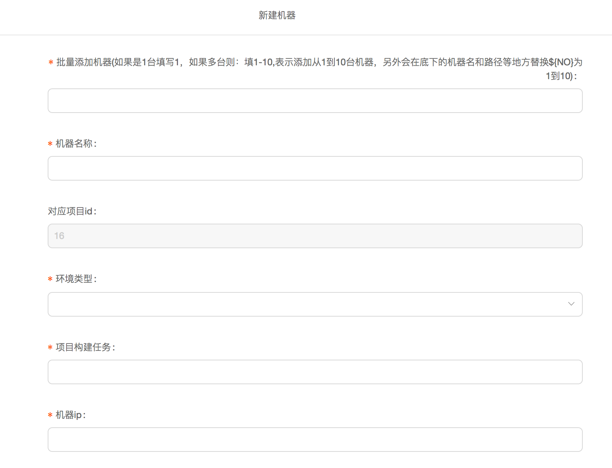
          
          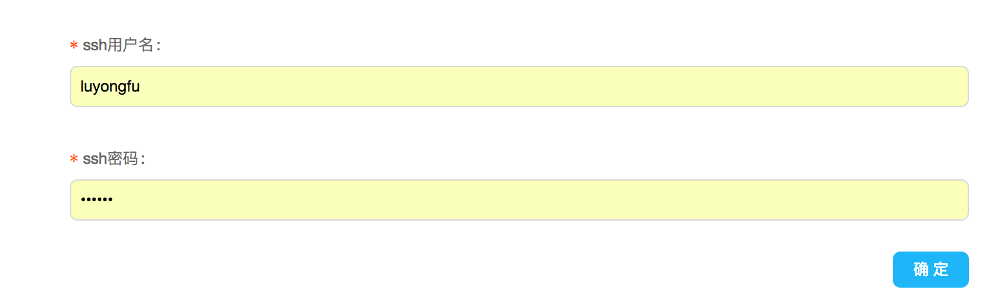
                                       
   
   
   机器名称：随便取一个机器名称就可以，比如test1
   
   环境类型：分为测试，预发布，正式，直接选择就好。
   
   构建项目任务:构建时候执行的命令，比如 npm run build test1，这个是在项目跟目录下执行（部署这台机器的时候的构建命令，也可以在部署的时候选用自定义构建命令）
   
   机器ip:填写目标部署机器，就是本项目要部署的机器ip
   
   发布源目录：需要部署的目录，即执行构建完构建后需要部署到目标机器的目录，多个可以用';'隔开，对应发布目标目录项数据
   
   发布目标目录：需要将‘发布源目录’里的目录部署到目标机器的对应目录，多个用';'隔开，对应发布目标项。
   
   部署hook:（自定义hook,具体会在高级使用里有描述）
   
   hook参数：（自定义hook参数,具体会在高级使用里有描述）
   
   部署命令执行目录：如果部署时需要在目标机器执行命令，则需要填写命令执行目录
   
   部署前执行命令：如果部署前需要在目标机器执行命令，则需要填写命令，该命令会在开始部署之前在目标机器的‘部署命令执行目录’上执行
   
   部署完成执行命令：如果部署后需要在目标机器执行命令，则需要填写命令，该命令会在完成部署之后在目标机器的‘部署命令执行目录’上执行
   
   ssh用户：最终的部署是用rsync命令部署的，需要填写ssh用户名
   
   ssh密码：如果需要ssh密码则填写上
   
   
   
4. 构建部署
    
    填写完机器就可以进行部署了，点击工程列表菜单进入工程列表页，点击项目进入项目主页。
    首先点击‘开始检出’将代码从代码仓库拉取到部署平台机器,这里部署平台做了几件事情：
    1.将本次要部署代码从代码仓库部署到部署机器
    2.判断是否有过上线部署如果有则，则拉取上次部署代码tag，进行比较，列出本次部署跟上次线上部署的新增文件，修改文件未修改文件，并根据提交人显示从上次上线正式环境到本次部署的提交历史，如下图所示：
    
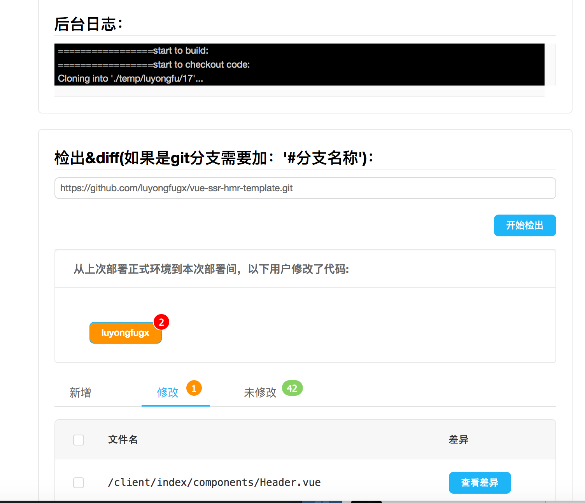

     
黄色用户名按钮显示的是从上次部署上线到现在，都有谁提交了多少次commit（按钮内容是提交者id,右上角数字是提交次数），点击按钮弹出该成员从上次上线到本次上线间的提交历史，如下图所示：
     
 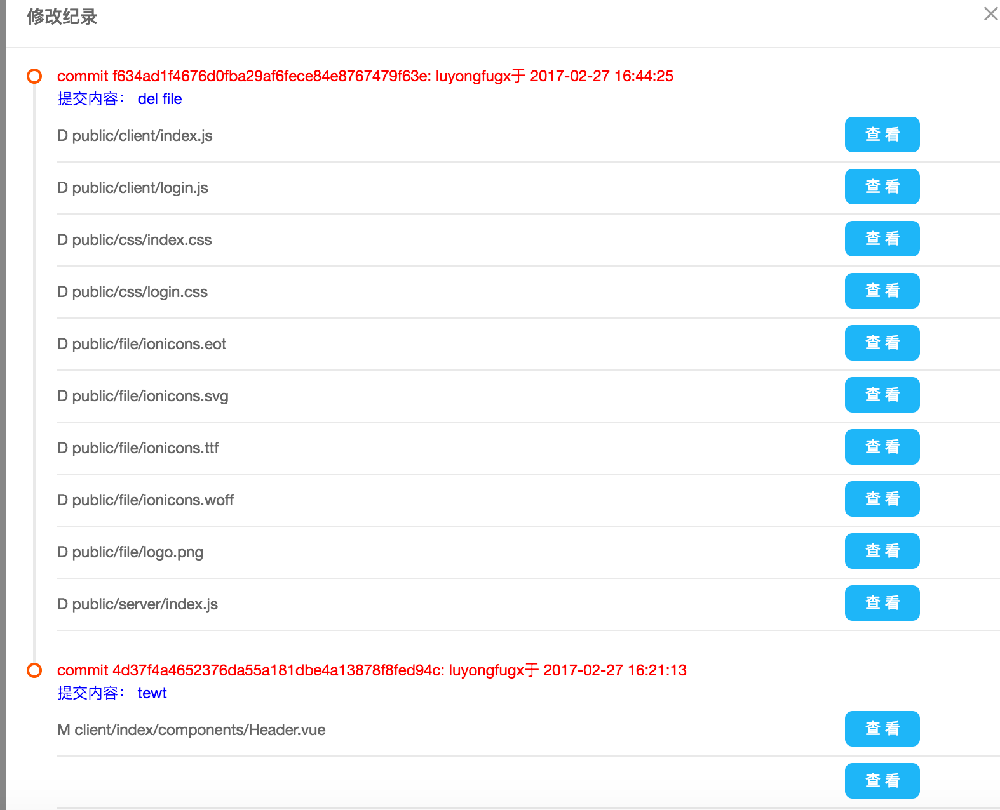

     
   点击某个文件右边的蓝色‘查看’按钮，会显示出该文件在本次提交的具体修改（绿色表示提交后版本，红色表示提交前版本），如下图所示：
   
  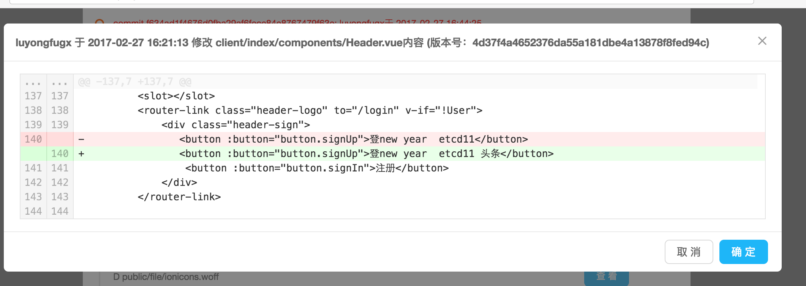
   

   
   除了列出每个成员的commit历史，并提供查看每次修改的记录以外，系统还提供了从上次正式上线到本次上线间文件的变化总览和明细，提供了新增，修改，未修改3个tab来显示文件变化情况（tab右上角的数字表示新增，修改，未修改的数字）。底部的文件列表列出了具体文件，对于修改的文件，点击‘查看差异’按钮可以显示具体修改了文件的那些地方，如下图所示：
   
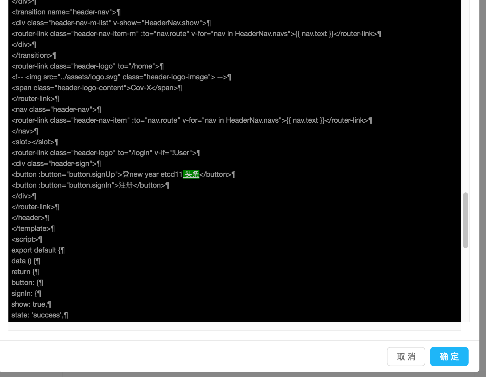
     
 
   
   检查检出步骤的各种输出，都没问题后就可以进行构建打包了。由于部署系统支持部分文件上线的功能。如果需要部分文件上线，需要从检查结果列表里面点击选择要上线的文件，并选择是通过只上线选择文件还是上线除被选择文件以外的文件的方式来实现部署上线，如下图所示：

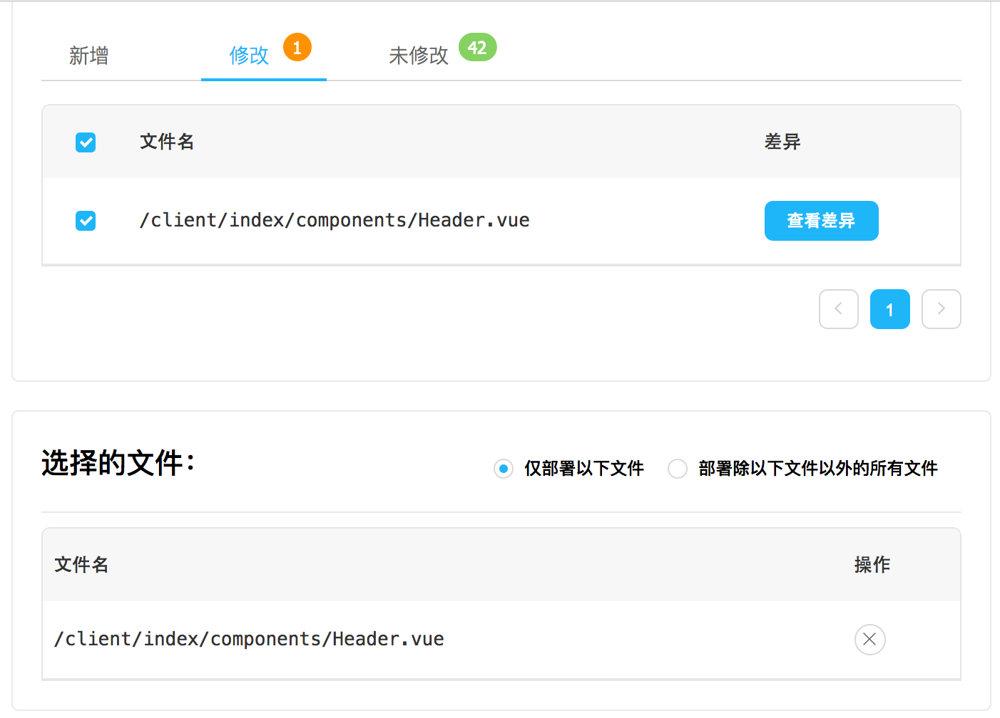
   

     
   到这里我们可以开始对项目进行构建打包了，你可以通过选择指定机器部署构建来执行构建（执行在填写部署机器时填写的构建命令进行构建），也可以通过自定义构建命令来进行构建（填写的命令会在跟目录下直接执行）,如果是js项目，为了减少npm install的时间，第一次请选择是否跟新node_modules,后面如果构建依赖没有变化，则可以不选择，界面如下图：
   
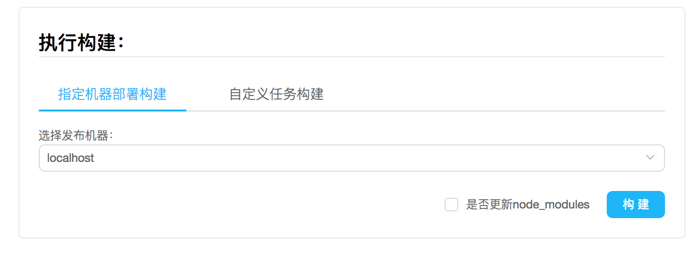
   
    
   点击‘构建’按钮执行构建，构建命令输出可以在‘后台日志’里看到，查看输出日志，看看是否构建成功，如下图所示：
 
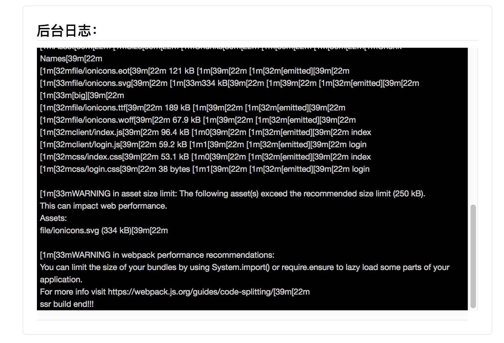
     
   
 构建完成，还可以通过构建结果的按钮查看构建后的，如下2图所示：
 
       
 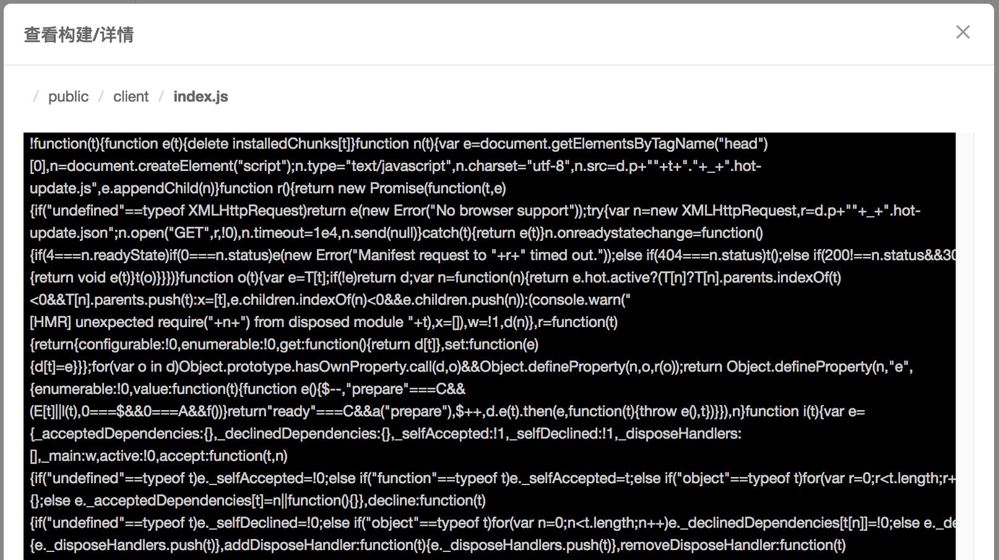      
      
   构建完成后，底部的部署按钮会由灰转量，这时候我们只要填写好部署说明和部署原因，点击部署就可以完成部署了（值得一提的是，可以选择一次部署多台机器），如下图所示：
   
 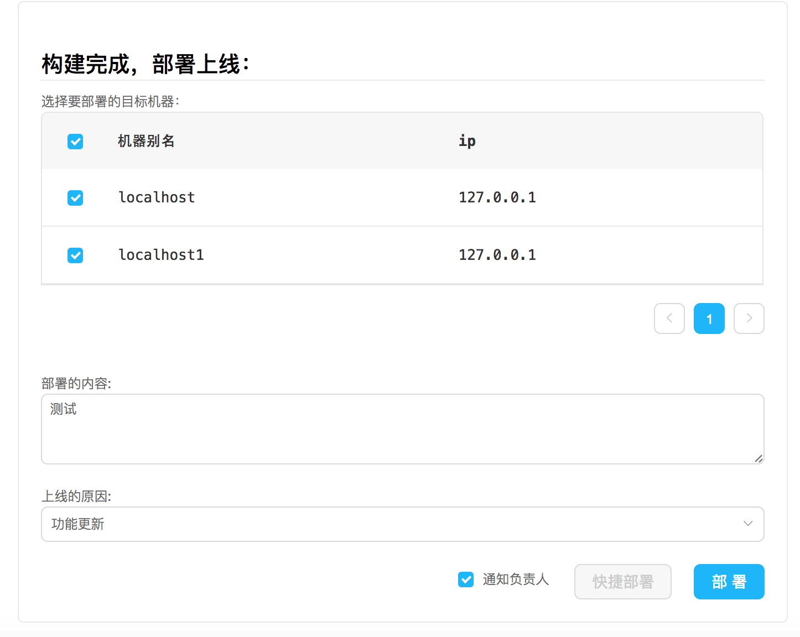      
      

部署完成后，会弹出一个层，表示部署完成并且询问是否锁定部署机器，如果锁定则这个项目的这台机器不能再部署，只有本次部署的人解锁以后才可以继续部署:
  	
       
 
  	另外从后台日志输出模块也可以实时看到部署过程，如果部署的事正式线上项目，那么系统还会自动给项目打tag留存
  	
  	到此我们的第一个项目部署完成，需要部署其他项目或者机器的，请按照添加项目的机器的规则进行添加部署即可
  	

## 支持多语言构建部署：
      
 

这个项目本来是为了前端构建部署而设计的，但是随着系统的日益完善，我们也支持其他语言如   java项目的构建和部署，接下来我们来看看如何部署一个通过maven管理的javaweb项目（我随便找了个javaweb项目fork出来：https://github.com/luyongfugx/maventest.git）。

1.首先部署平台所在机器需要安装jdk(java运行环境)，目标机器安装好tomcat

2.在新建项目的时候，我们选择程序语言为java(这样在点击构建的时候，其实是执行，src/common/service/impl/build_java.sh '命令执行目录' 'mvn package 命令行' '项目id' '是否npm install')

3.在添加机器时，构建命令我们填写mvn package(maven编译命令),部署前需要删除服务器上代码可以直接配置部署前命名删除，部署后需要重启则可以填写重启命令比如这个项目我们填写的如下信息:

 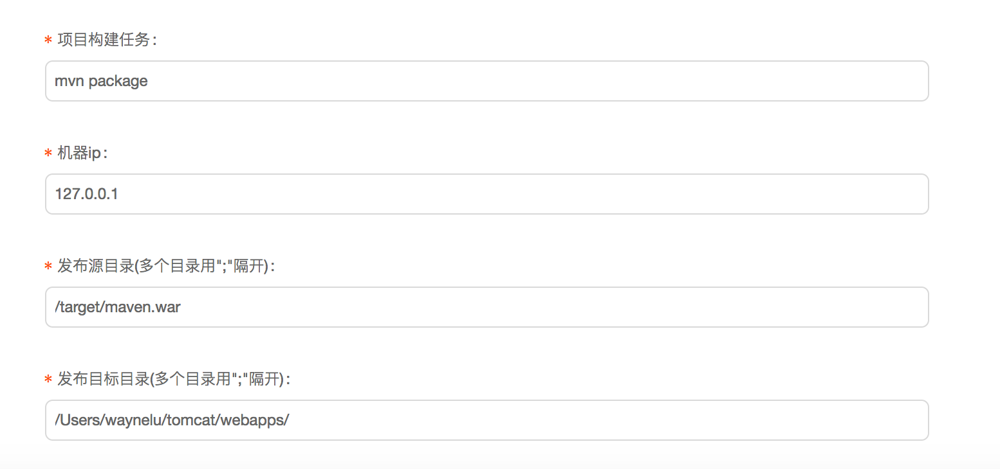 
 
 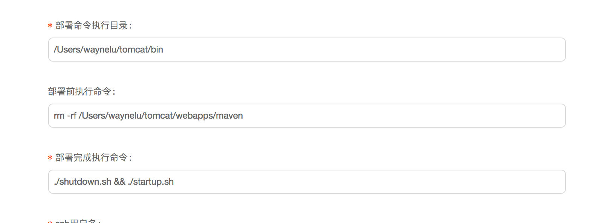

以上是我们内置java语言的内置脚本。如果想添加其他语言的部署，也可以通过扩展程序来支持，举个增加go语言的例子
首先打开frontend/component/project_detail_component/do_build.jsx文件，增加新建项目的时候的go语言的支持，代码如下
	<pre><code>
    this.state={
      getItemList:'',
      selectedRows:'',
      codeLangArray:['javascript','java','go'],//增加go语言支持。
      selectedMacRowKeys :''
    }
	 </code></pre>	
	
 

添加完重新build项目运行，添加项目的时候语言就多了一个go选项，填上你的项目名称和代码仓库地址(这个例子是一个特别简单的httpserver,需要本地编译上传，重启)。
然后到src/common/service/ipml目录下增加build_go.sh文件,点击构建的时候会执行这个文件,并传入4个参数，'命令执行目录' '执行的命令' '项目id' '是否npm install'，根据这个我们可以执行编译命令，以下是我们写的build_go.sh文件。
	<pre><code>
	#!/bin/bash
	projectPath=$1
	cd $projectPath
	echo '开始构建'
	$2
	 </code></pre>	
	
 

接着我们需要在添加机器的时候填写构建命令和重启命令，例子如下：

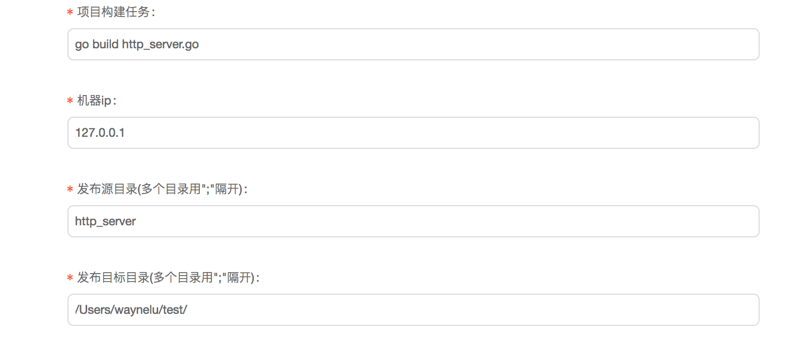
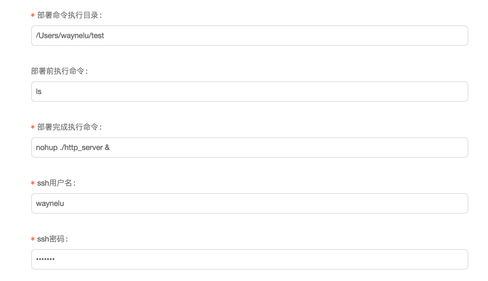

添加完我们就可以走之前的构建部署流程进行部署了，部署完成输入：
http://localhost:4000/string 
看到内容说明部署成功
	
		

## 编写插件支持高级功能

部署系统还提供了2种hook,方便我们在构建，部署前后编程做一些特殊的工作（比如我们部署一个web服务的过程中，如果部署时间比较长，为了避免用户访问到正在部署的机器，需要先从nginx中摘掉，等部署完后再把他添加到nginx列表中），在这我们举个例子来做一个示范。
1.首先我们需要知道如何调试部署平台程序
  部署平台主要包含2部分代码：
  web前端代码，主要由reactjs+antd组成，根目录下执行npm run frontdev来自动监控编译前端代码
  web后端代码，用thinkjs框架开发，根目录下执行npm run dev来自动监控编译后端代码

2.hook分为构建hook和部署hook两种。
  构建hook，顾名思义就是构建某个项目的时候调用的hook,分为构建前调用和构建后调用2个hook方法。由于项目使用thinkjs开发，我们把hook类定义成一个thinkjs service类，具体的一个例子，我们新建一个名字为build_nodejs_plugin.js的文件，内容为：
  	<pre><code>
'use strict';
class BuildPlugin extends think.service.base {
      init(...args) {
          super.init(...args);
      }
      async before(params){
        console.log('before build hook :',params);
        return params;
      }
      async  after(params){
        console.log('afterProject build hook :',params);
        return params;
      }
}
export default new BuildPlugin();
	 </code></pre>	
before方法是项目构建前会调用，after方法是项目构建后会调用，params为传入参数，参数主要是一些项目信息和构建信息,比如：
<pre><code>
{
  id: 17,
  name: 'ssr',
  creater: 'waynelu',
  vcs_type: 1,
  code_url: 'https://github.com/luyongfugx/vue-ssr-hmr-template.git',
  build_type: 0,
  online_tag: '2017022700004',
  last_tag: '2017022700004',
  pub_time: '2017-02-24 10:14:30',
  status: '1',
  op_item_id: 0,
  op_item_name: '0',
  code_lang: 'javascript',
  hook_params: 'port:8081',
  deploy_hook: 'deploy_nodejs_plugin',
  build_hook: 'build_nodejs_plugin',
  task: 'build ',
  pro_id: 17,
  pro_name: 'ssr',
  sessionUser: { id: 1, name: 'luyongfu', pass: '111111', avatar: 'avatar' },
  shellParams:
   { build_shell: './src/common/service/impl/build_javascript.sh',
     buildDir: './temp/luyongfu/17',
     task: 'build ',
     isNpmInstall: '1' },
  buildDir: './temp/luyongfu/17' }
  
</pre></code>
将这个js放到src/common/service目录下，然后到项目信息里面添加构建hook为build_nodejs_plugin，这样在构建前后会分别调用before和after,如果想添加参数，
可以填写hook参数，这个参数会被传入before,after方法里。

部署hook,是在部署前后调用的hook,内部又细分为部署项目前后的总hook和部署某台机器前后的hook，我们还是同样建立一个deployHook，新建一个deploy_nodejs1_plugin.js文件，内容如下：
<pre><code>
'use strict';
class  DeployPlugin1 extends think.service.base {
      init(...args) {
          super.init(...args);
      }
      async beforeProject(params){
        console.log('beforeProject hook1 :',params);
        return params;
      }
      async  afterProject(params){
        console.log('afterProject hook1 :',params);
        return params;
      }
      async beforeMachine(params,projectHookParams){
        console.log('beforeMachine hook1 :',params,projectHookParams);
        return params;
      }
      async afterMachine(params,projectHookParams){
        console.log('afterMachine hook1 :',params,projectHookParams);
        return params;
      }
}
export default new DeployPlugin1();
</pre></code>

我们同样把这个文件放到src/common/service目录下，这样在部署的时候，一开时会调用beforeProject，然后再每台机器部署前后调用beforeMachine,afterMachine方法，最后再调用afterMachine 方法，我们在项目基本信息的时候填写部署hook为deploy_nodejs1_plugin，如果需要每台机器有特殊hook,则在机器基本信息里填写部署hook(这时候部署这台机器时会只执行本hook的beforeMachine,afterMachine方法，不执行项目基本信息里面的beforeMachine,afterMachine方法)

